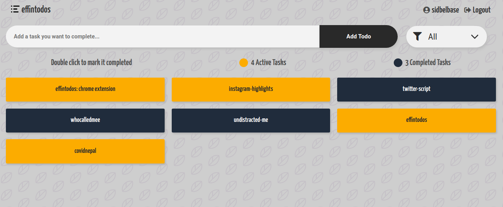

<h1 align="center">

<strong> 
effintodos
</strong>
</h1>

### As Joan Konner said:

> #### Procrastination always gives you something to look forward to.

#### So here's another todo app to look into our procastinating lives.



## Introduction

**effintodos** is a simple todo app that helps you complete your tasks like they are supposed to. It eliminates the typical ~~strikethrough~~ and checkbox styles. So like in the image above it does them in **post-it note** style. It is inspired from a youtube tutorial but developed further to fit both UI & UX in mind. It is intuitive and simple to use bundled in a SPA (Single-Page Applications) with the use of the Vue framework along with added user authentication.

### Features

* Double click on sticky notes to mark it completed
* Filter through active & completed tasks
* Ultra fast task syncronization across all your logged devices
* Load your data at once & sync later
* Clear completed options

<h4><a href="https://effintodos.now.sh">Go to website | effintodos.now.sh</a><h4>


## Prerequisites

* Node.js
* Yarn Package Manager
* Firebase Account
* Firestore Database

## Used

#### Tools & Frameworks

* Vue : JS Framework
* Vuex : State Management
* Firebase : Authentication 
* FontAwesome: Font Icons
* Firestore : Database & Storage
* Bulma: CSS Framework

 #### Websites
* <a href="https://loading.io">loading.io</a>
* <a href="https://carbon.now.sh">carbon.now.sh</a>
* <a href="https://tinypng.com">tinypng.com</a>
* <a href="https://iconscout.com/">iconscount.com</a>
* <a href="https://unsplash.com">unsplash.com</a>
* <a href="https://vuejs.org">vuejs.org</a>


## Installation

#### First, replace your firebase/firestore credentials inside .env_sample & rename it into .env

.env_sample
```env
VUE_APP_API_KEY="API KEY HERE"
VUE_APP_AUTH_DOMAIN="AUTH DOMAIN HERE"
VUE_APP_DATABASE_URL="DATABASE URL HERE"
VUE_APP_PROJECT_ID="PROJECT ID HERE"
VUE_APP_STORAGE_BUCKET="STORAGE BUCKET HERE"
VUE_APP_MESSAGING_SENDER_ID="SENDER ID HERE"
VUE_APP_APP_ID="APP ID HERE"
```

#### Go to root folder & install the packages using: `yarn install`


## Development Setups

#### To compiles and hot-reload for every changes: `yarn serve`

#### To compiles & minify for production: `yarn build`


### Made with ❤️ in Nepal.